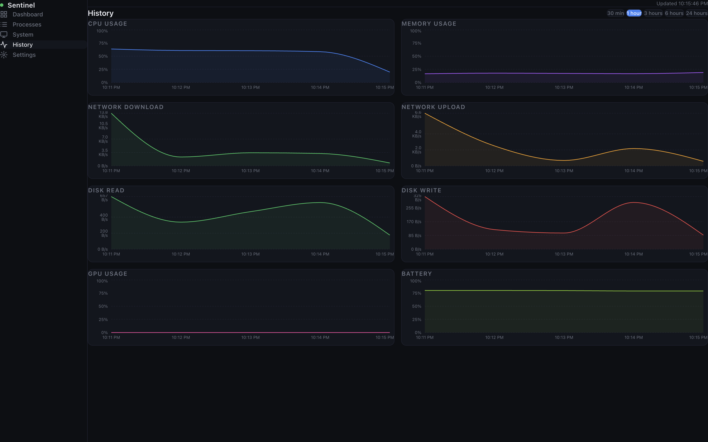

<p align="center">
  
</p>

<h1 align="center">Sentinel</h1>

<p align="center">
  Local-first desktop system monitor built with Electron, React, and TypeScript.
</p>

---

Sentinel is a desktop system monitoring app that provides a clean local dashboard for monitoring system performance, running processes, hardware information, startup applications, and overall system health.

> Sentinel is currently in active development.

## Download

Prebuilt packages are available from the [latest GitHub release](https://github.com/Drippyz1/sentinel/releases/latest).

## Features

### Monitoring Dashboard

* Real-time CPU usage
* Memory monitoring
* Disk usage tracking
* Network activity monitoring
* GPU statistics
* Battery information
* Pause and resume live dashboard updates
* Historical metric charts and tables
* CSV history export
* Local anomaly detection and system notifications

### Process Management

* View running processes
* Search processes
* Sort by CPU, memory, PID, and name
* Quick filters and compact/comfortable table density
* Process termination with confirmation prompts

### System Information

* Hardware information
* Operating system details
* Thermal monitoring
* Startup application management
* Machine specifications
* Simple and advanced system views

### Local Preferences

* Persistent dashboard, history, process, and system view preferences
* Configurable polling interval, temperature unit, retention, and anomaly sensitivity

### Platform Limitations

* On some Apple Silicon Macs, macOS does not expose CPU or GPU temperature sensors without
  elevated permissions. Sentinel reports these readings as unavailable and does not request
  elevated permissions or install privileged helpers.

## Screenshots

<p align="center">
  
  
</p>

<p align="center">
  
  
</p>

<p align="center">
  
</p>

## Tech Stack

* Electron
* React
* TypeScript
* Tailwind CSS
* Zustand
* Recharts
* better-sqlite3
* systeminformation

## Installation

### Prerequisites

* Node.js 20+
* npm 10+

### Clone the Repository

```bash
git clone https://github.com/Drippyz1/sentinel.git
cd sentinel
```

### Install Dependencies

```bash
npm ci
```

## Development

Start the development environment:

```bash
npm run dev
```

## Quality Checks

### Type Checking

```bash
npm run typecheck
```

### Linting

```bash
npm run lint
```

### Formatting

```bash
npm run format
```

## Building

### Windows

```bash
npm run build:win
```

### macOS

```bash
npm run build:mac
```

### Linux

```bash
npm run build:linux
```

Platform packages are written to `dist/`. Build each target on its native operating system because Sentinel includes the native `better-sqlite3` module.

> Startup item management and detailed thermal information currently use macOS system services. Other monitoring features use cross-platform collectors where supported by the host.

## Roadmap

### Near-Term Goals

* [ ] Add demo GIFs
* [ ] Improve startup item support
* [ ] Expand automated testing

### Long-Term Goals

* [ ] Plugin architecture
* [ ] Automatic update support
* [ ] First stable release

## Contributing

Contributions are welcome.

Please read [CONTRIBUTING.md](.github/CONTRIBUTING.md) before opening a pull request.

Bug reports, feature requests, documentation improvements, and code contributions are appreciated.

## Project Status

Sentinel is currently an early-stage project and should be considered experimental. Features, APIs, and internal architecture may change between releases.

## License

Distributed under the MIT License.
