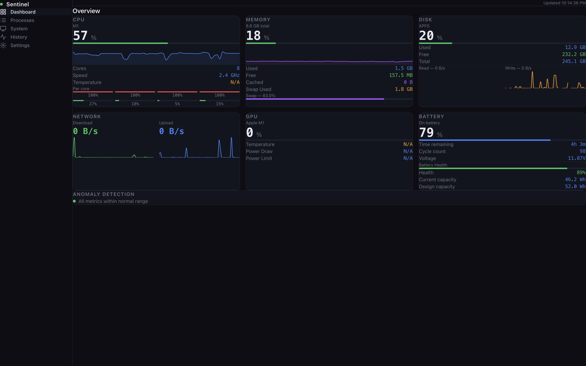
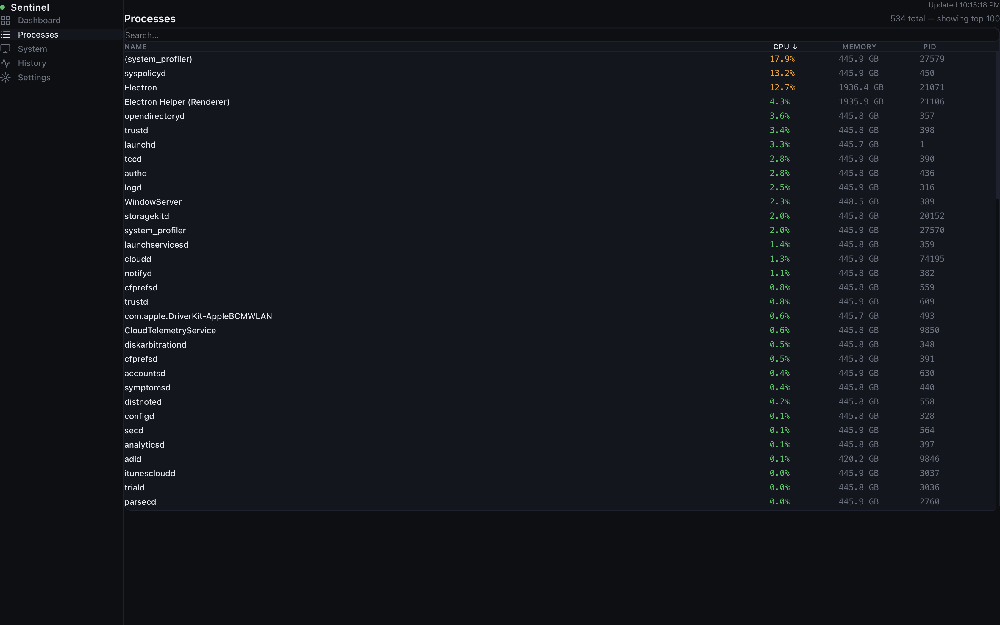
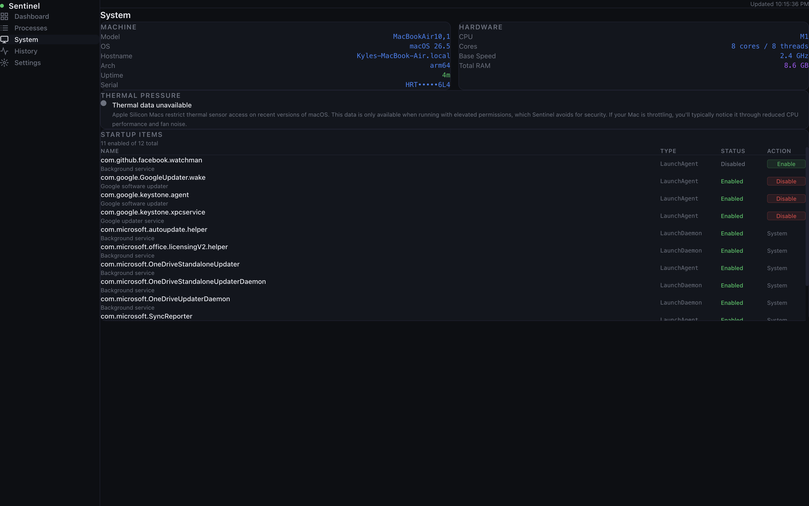
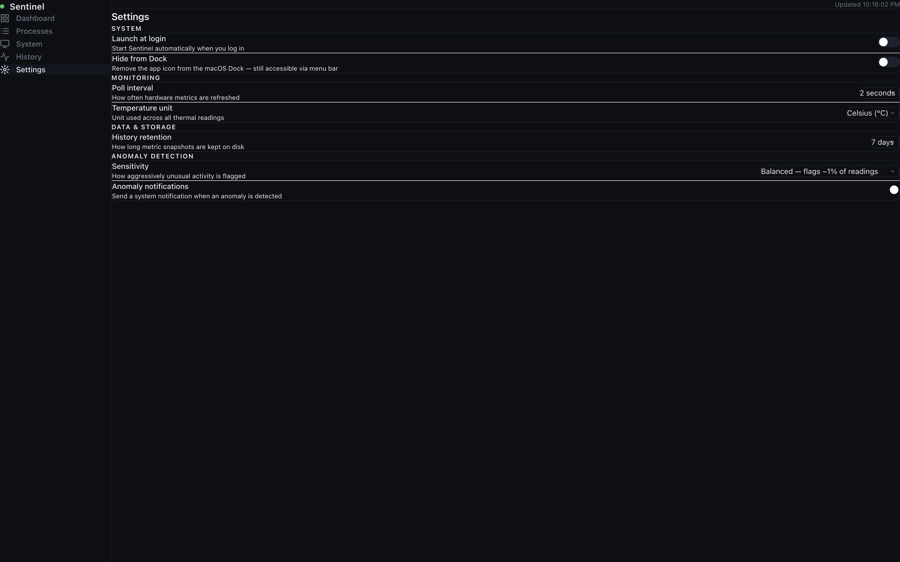

<p align="center">
  
</p>

<h1 align="center">Sentinel</h1>

<p align="center">
  Local-first desktop system monitor built with Electron, React, and TypeScript.
</p>

---

Sentinel is a desktop system monitoring app that provides a clean local dashboard for monitoring system performance, running processes, hardware information, startup applications, and overall system health.

> Sentinel is currently in active development.

## Features

### Monitoring Dashboard

* Real-time CPU usage
* Memory monitoring
* Disk usage tracking
* Network activity monitoring
* GPU statistics
* Battery information
* Historical metric charts

### Process Management

* View running processes
* Search processes
* Sort by CPU, memory, PID, and name
* Process termination with confirmation prompts

### System Information

* Hardware information
* Operating system details
* Thermal monitoring
* Startup application management
* Machine specifications

## Screenshots

<p align="center">
  
  
</p>

<p align="center">
  
  
</p>

## Tech Stack

* Electron
* React
* TypeScript
* Tailwind CSS
* Zustand
* Recharts
* better-sqlite3
* systeminformation

## Installation

### Prerequisites

* Node.js 20+
* npm

### Clone the Repository

```bash
git clone https://github.com/Drippyz1/sentinel.git
cd sentinel
```

### Install Dependencies

```bash
npm install
```

## Development

Start the development environment:

```bash
npm run dev
```

## Quality Checks

### Type Checking

```bash
npm run typecheck
```

### Linting

```bash
npm run lint
```

### Formatting

```bash
npm run format
```

## Building

### Windows

```bash
npm run build:win
```

### macOS

```bash
npm run build:mac
```

### Linux

```bash
npm run build:linux
```

## Roadmap

### Near-Term Goals

* [ ] Add demo GIFs
* [ ] Improve UI consistency
* [ ] Expand historical metrics
* [ ] Improve startup item support
* [ ] Add settings persistence
* [ ] Add GitHub Actions CI/CD

### Long-Term Goals

* [ ] Exportable system reports
* [ ] Plugin architecture
* [ ] Alert and notification system
* [ ] Automatic update support
* [ ] First stable release

## Contributing

Contributions are welcome.

Please read [CONTRIBUTING.md](.github/CONTRIBUTING.md) before opening a pull request.

Bug reports, feature requests, documentation improvements, and code contributions are appreciated.

## Project Status

Sentinel is currently an early-stage project and should be considered experimental. Features, APIs, and internal architecture may change between releases.

## License

Distributed under the MIT License.
::: 
